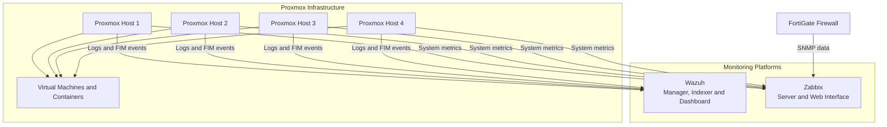

# Wazuh and Zabbix Monitoring for a Proxmox Infrastructure

This project documents the work I completed during my cybersecurity internship to improve security and infrastructure monitoring in a Proxmox-based environment.

The solution combines:

- **Wazuh** for log analysis, security monitoring and File Integrity Monitoring
- **Zabbix** for availability, performance and capacity monitoring

The monitored environment included Proxmox hosts, virtual machines, containers and a FortiGate firewall.

All information published in this repository has been sanitized. Real credentials, IP addresses, hostnames and company-specific information are not included.

## Architecture



The diagram uses generic names and does not represent the complete internal company topology.

## Wazuh Security Monitoring

I configured Wazuh agents on the Proxmox hosts to collect system logs and monitor security-related activity.

The implementation included:

- Linux log collection
- File Integrity Monitoring
- Monitoring of Proxmox configuration paths
- Custom detection and correlation rules
- Saved searches for investigations
- Security dashboards
- Alert testing
- False-positive reduction

One of the main monitored locations was `/etc/pve`, which contains important Proxmox cluster and firewall configuration files.

I also created a focused search for changes affecting the Proxmox firewall configuration path.

### File Integrity Monitoring

During testing, I confirmed that File Integrity Monitoring was active across the Proxmox configuration directory.

A frequently updated Proxmox status file was generating unnecessary events. Instead of excluding the entire directory, I excluded only the noisy file to preserve visibility over the remaining configuration paths.

### Custom Correlation Rule

I created a Wazuh correlation rule to detect repeated matching events within a defined period.

The rule used `if_matched_sid`, a frequency threshold and a time window to correlate structured Wazuh events rather than relying on raw log-text matching.

## Zabbix Infrastructure Monitoring

Zabbix was used to monitor the operational state and capacity of the Proxmox hosts.

The monitored areas included:

- Agent availability
- ICMP availability
- CPU usage
- Memory usage
- Swap usage
- Disk utilization
- Disk-capacity forecasting

Disk triggers were first tested on one host and then replicated across four Proxmox nodes.

A total of **24 disk-related triggers** were configured, combining static thresholds with forecast-based alerts.

An example ICMP trigger expression was:

```text
max(/host/icmpping,#3)=0
```

This trigger activates when the latest three ICMP checks have all failed, reducing alerts caused by a single lost packet.

## FortiGate Monitoring

The FortiGate firewall was prepared for Zabbix monitoring through SNMPv2c.

The SNMP configuration used:

- Read-only access
- Access restricted to the Zabbix server
- SNMPv1 disabled
- No SNMP exposure on the WAN interface

The intended monitoring scope included device availability, interface status, network traffic and resource usage.

## Validation

| Test | Expected result | Status |
|---|---|---|
| Stopping a monitoring agent | Agent-disconnection alert | Validated |
| Modifying a monitored test file | File Integrity Monitoring alert | Validated |
| Generating repeated matching events | Correlation alert | Validated |
| Reaching a disk threshold | Zabbix disk alert | Validated |
| Failing multiple ICMP checks | Host-unavailable alert | Validated |

All tests were controlled, reversible and designed to avoid disruption to the production environment.

## Technologies

| Area | Technologies |
|---|---|
| Security monitoring | Wazuh, File Integrity Monitoring, custom rules |
| Infrastructure monitoring | Zabbix, agents, triggers, forecasting |
| Virtualization | Proxmox VE |
| Network monitoring | FortiGate, SNMPv2c, ICMP |
| Systems | Linux, Windows Server |
| Administration | Bash, PowerShell, SSH |
